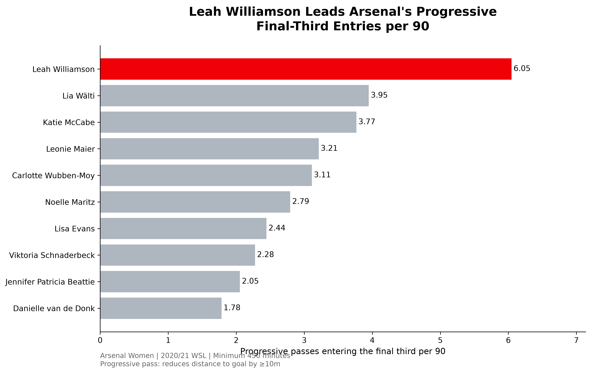
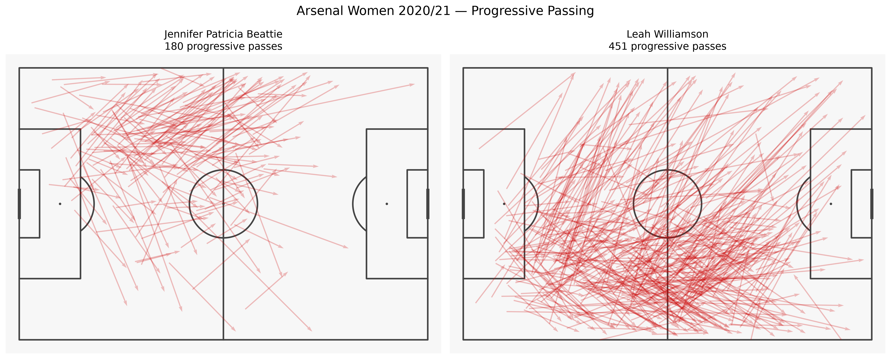

# Arsenal Women 2020/21: Analysing Ball Progression

## Project Overview

This project investigates how Arsenal Women progressed the ball through passing during the 2020/21 Women's Super League season, with a particular focus on Leah Williamson's contribution.

Using StatsBomb open event data and Python, the analysis compares players' progressive passing volume, frequency per 90 minutes, and ability to move possession into the final third.

**Research question:** How important was Leah Williamson to Arsenal Women's ball progression during the 2020/21 WSL season?

## Key Findings

- **Leah Williamson led Arsenal in total progressive passes**, highlighting her substantial involvement in advancing possession.
- **Jennifer Beattie ranked first for progressive passes per 90 minutes**, demonstrating the importance of accounting for playing time.
- **Williamson ranked first for progressive final-third entries per 90**, suggesting a particularly important role in moving possession into advanced areas.
- Of Williamson's progressive passes, **26.16% entered the final third**, compared with **7.78% of Beattie's**.
- Passing maps showed Beattie's progressive passes were more concentrated on the left, while Williamson's were more spatially varied and tended to finish farther upfield.

## Main Visualisation

*Progressive final-third entries per 90 minutes for Arsenal Women players with at least 450 minutes played.*

## Methodology

**Data:** StatsBomb open event data for Arsenal Women's 22 matches in the 2020/21 WSL season.

**Tools:** Python, pandas, NumPy, Matplotlib, mplsoccer and statsbombpy.

Two simplified definitions of a progressive pass were examined:

1. A completed pass advancing the ball at least 10 metres along the pitch.
2. A completed pass reducing the ball's straight-line distance to the opposition goal by at least 10 metres.

A progressive final-third entry was defined as a pass satisfying the second progression criterion that started outside the final third and finished inside it.

Player minutes were estimated from StatsBomb lineup position intervals and match-end events. Per-90 statistics were calculated using those minutes, with a minimum playing-time threshold of 450 minutes.

## Limitations

- Progressive passing definitions are simplified and may favour certain positions or tactical roles.
- The analysis measures territorial progression, not pass difficulty, possession value or the quality of subsequent attacking opportunities.
- Playing time includes recorded stoppage time and is estimated from event timestamps.
- Results cover one team and one season, so conclusions should not automatically be generalised.

## Conclusion

Although Jennifer Beattie led Arsenal in progressive passes per 90 minutes, Leah Williamson stood out for her contribution to moving the ball into the final third.

The analysis demonstrates why progressive passing should be evaluated using multiple metrics: total volume, frequency relative to minutes played, and the areas of the pitch reached.

## Data Source

StatsBomb Open Data — https://github.com/statsbomb/open-data

Data provided by StatsBomb. This project is an independent portfolio analysis.